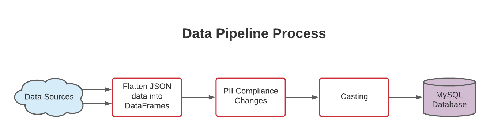

This is the assessment of skillset as part of the interview process of Spark Network for Junior Data Engineer position. 

## Project Description:
This project is composed of an ETL challenge, combined with Python, SQL and git skills. In which we extract information from a RestAPI, make transformations so the data is PII complient and ready for further analyses, and load this information into a database.

With this project I create a database in the following format:


## Requirements:
For this project to sucessfully run the following installations are requered in the enviroment.
```
pip install requests
pip install pandas
pip install sqlalchemy
pip install credentials
pip install pymysql
```
##### A requirements.txt is available in the python folder.

## How to Use it:
- Firstly dowload the repository.
- Open the file 'credentials.py' and edit with the information for you personal server.
```
mysql_db_config = {
    'host': '127.0.0.1',
    'user': 'my_user',
    'password': 'my_password',
    'port': 3306,
    'database' : 'spark_networks_test'
}
```
- Run main.py
- Utilize sql_test.sql to run queries in the new database.

## How does it work:

The project begins by making requests from the data sources in a RestAPI, wich returns a JSON response that is storaded into variables in the program. In the next step the program flattens the data and adds the information into DataFrames for easier manipulation. From the DataFrame, first a cleaning of personal information is performed, then the information is casted into the right datatypes. And finally a connection to the database is performed, if the database or tables don't exists yet they are created and finally the data is uploaded into the database.
A group of queries are provided in the file sql_test,sql in which you may performe some tests in the information uploaded into the database.

## Contributors:
Timnna Aversa <timnaaversa@gmail.com>

## License and Copyright
© Timna Costa Aversa

Licensed under the [MIT License](License).


