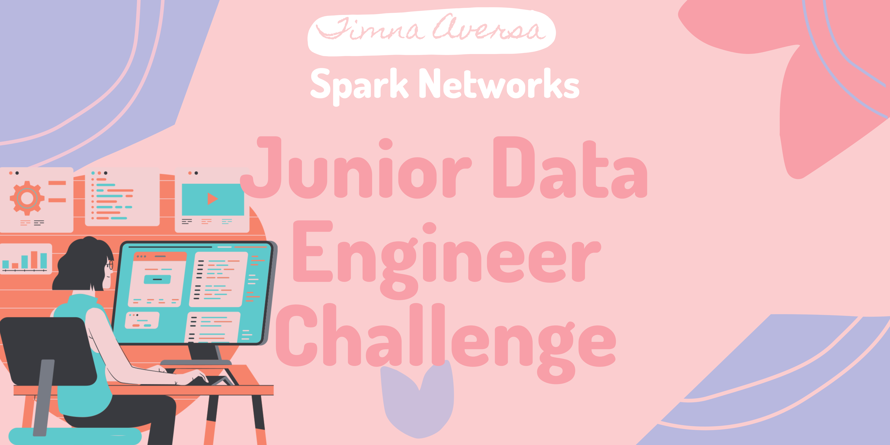
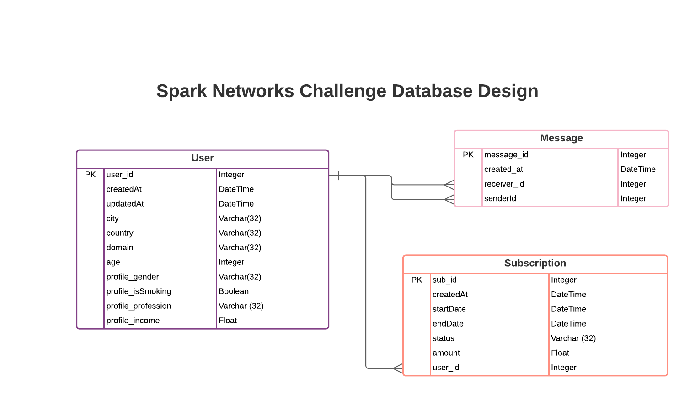
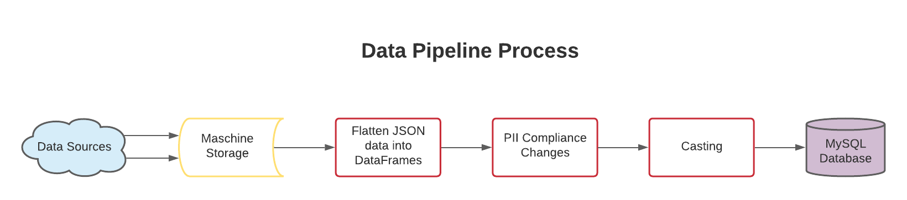

This is the assessment of skillset as part of the interview process of Spark Network's hiring process for Junior Data Engineer. 

## Project Description:
This project is composed of an ETL challenge, combined with Python, SQL and git skills. In which we extract information from a RestAPI, make transformations so the data is PII complient and ready for further analyses, and load this information into a database.

With this project we create a database in the following format:


## Requirements:
For this project to sucessfully the following installations are requered in the enviroment.
```
pip install requests
pip install pandas
pip install sqlalchemy
pip install credentials
pip install pymysql
```
##### A requirements.txt is available in the repository files. Also a virtual enviroment called env is part of the repository and already prepared for the use of this project.
This project was created to run in a MySQL database, please have a already set up MySQL Server to run this project.

## How to Use it:
- Firstly dowload the repository.
- Open the file 'credentials.py' and edit with the information for you personal server.
```
mysql_db_config = {
    'host': '127.0.0.1',
    'user': 'my_user',
    'password': 'my_password',
    'port': 3306,
    'database' : 'spark_networks_test'
}
```
- Run main.py
- Utilize sql_test.sql to run queries in the new database.

## How does it work:


## Contributors:
Timnna Aversa <timnaaversa@gmail.com>

## License and Copyright
© Timna Costa Aversa

Licensed under the [MIT License](License).

